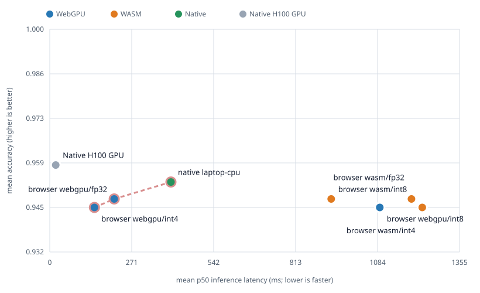
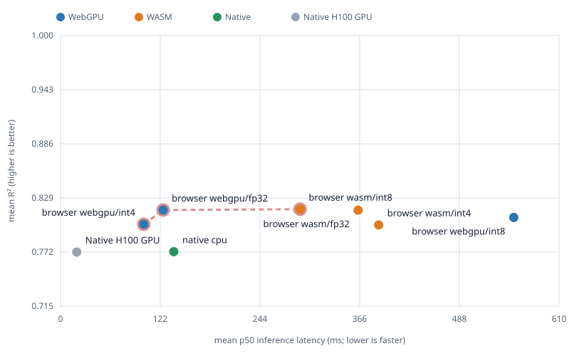

# WebTabPFN

TabPFN v2 classification and regression in the browser. WebTabPFN downloads a prepared ONNX
model, caches it across pages, and runs it through an explicitly selected WebGPU or WASM
backend. Input data never leaves the browser.

> **Built with PriorLabs-TabPFN.** WebTabPFN is an independent, unofficial browser port and is
> not affiliated with or endorsed by Prior Labs.

## Use

Pin an exact npm version in production:

WebTabPFN is distributed as a classic browser script, not an ESM/CommonJS import.

```html
<script src="https://cdn.jsdelivr.net/npm/webtabpfn@0.2.0/src/webtabpfn.js"></script>
<script>
  const classifier = await WebTabPFN.load({
    task: "classification",
    backend: "wasm",
    precision: "int8"
  });
  classifier.fit(
    [[0.1, "low"],
     [0.2, "low"],
     [1.1, "high"],
     [0.9, "high"]],
    ["control", "control", "case", "case"],
  );
  console.log(await classifier.predict([[0.8, "high"]]));
  console.log(await classifier.predictProba([[0.8, "high"]]));

  const regressor = await WebTabPFN.load({
    task: "regression",
    backend: "wasm",
    precision: "int8" });
  regressor.fit(
    [[0], [1], [2], [3]],
    [1, 3, 5, 7]);
  console.log(await regressor.predict([[1.5], [4]]));
</script>
```

`task` is required. Classification returns original labels and probabilities; regression returns
raw-space mean predictions. Both estimators store their training context locally during `fit()`
and run the model when `predict()` or `infer()` is awaited. Call `dispose()` when an estimator is
no longer needed.

### Preprocessing

- Numeric, string, boolean, `null`, and `NaN` feature values are accepted.
- String and boolean columns are categorical. Numeric categorical columns can be declared with
  `fit(x, y, { categoricalFeatures: [1, 3] })`.
- Category mappings are learned from training rows only. Missing and unseen categories become
  `NaN`, which TabPFN handles internally.
- Rectangular train/test matrices with the same feature count are required. Infinite values fail.
- Classification labels may be finite numbers, strings, or booleans and are encoded internally.
- Regression targets must be finite numbers.

This is deliberately a small preprocessing contract, not full Python-estimator preprocessing.

### Loading, models, and cache

```javascript
const model = await WebTabPFN.load({
  task: "classification",
  backend: "webgpu",           // "webgpu" or "wasm"
  precision: "int4",           // "int4" or "int8" in npm
  cache: true,
  baseUrl: "https://cdn.example.org/webtabpfn/0.2.0/src/",
  runtimeBaseUrl: "https://cdn.example.org/webtabpfn/0.2.0/src/",
});
```

The npm package contains INT4 and INT8 for both tasks. Backend and precision are always explicit;
WebTabPFN makes no automatic model or backend choice.

FP32 artifacts stay in the repository for validation and benchmarking but are excluded from the
npm package to keep the npm/jsDelivr distribution compact and within this project's conservative
100 MB unpacked-content budget. Use a repository checkout or self-hosted `baseUrl` when explicitly
loading FP32; npm and jsDelivr distributions contain INT4 and INT8.

Preloading downloads and verifies weights without creating a session:

```javascript
await WebTabPFN.preload({ task: "regression", backend: "wasm", precision: "int8" });
const ready = await WebTabPFN.isCached({ task: "regression", precision: "int8" });
await WebTabPFN.clearCache();
```

Model filenames are content-hashed and downloads are checked for their expected byte length.
`WebTabPFN.models` contains only the task-keyed INT4 and INT8 metadata shipped through npm.

### Browsers and serving requirements

WebTabPFN bundles ONNX Runtime Web 1.27 and targets ES2022. Browser support follows the
[ONNX Runtime Web support matrix](https://onnxruntime.ai/docs/get-started/with-javascript/web.html):

| Backend | Supported browsers | Validation in this release |
|---|---|---|
| WASM | Current Chrome/Edge, Firefox, and Safari with WebAssembly SIMD and Cache Storage. ONNX Runtime explicitly lists Chrome/Edge on Windows, Android, macOS, and iOS; Safari on macOS and iOS; and Firefox on Windows. | Automated Chromium 151 tests on Windows. |
| WebGPU | Chrome/Edge 113+ on Windows and macOS, and Chromium 121+ on Android, when the browser exposes a usable GPU adapter. ONNX Runtime Web does not currently list Safari, iOS browsers, or Firefox as supported WebGPU targets. | Chrome 151 on Windows with Intel Xe-LPG. |

Serve production pages and assets over HTTPS. `http://localhost` and `http://127.0.0.1` are
treated as trustworthy for local development; loading from `file://` is unsupported. WebGPU and
the default `cache: true` path both depend on APIs restricted to secure contexts. Setting
`cache: false` avoids persistent Cache Storage but does not make WebGPU available on an insecure
origin. A self-hosted cross-origin asset server must allow CORS requests.

Cross-origin isolation is not required. Without it, ONNX Runtime uses one WASM thread; when the
page is cross-origin isolated, the runtime may use multiple threads. Backend selection is explicit:
`hasWebGpu()` is only a feature check, and `load()` fails rather than silently falling back when a
requested WebGPU adapter or session is unavailable.

### Dataset limits

The upstream TabPFN v2 design envelope is datasets with up to 10,000 samples and 500 features.
The exported classification model has an additional hard limit of 10 classes. These are model
limits, not a promise of interactive browser performance.

The checked browser quality matrices cover the following, substantially smaller shapes:

| Task | Training rows | Test rows per call | Features | Classes |
|---|---:|---:|---:|---:|
| Classification | 102-128 | 48 | 2-64 | 2-10 |
| Regression | 64 | 24 | 10-20 | n/a |

Model dimensions are dynamic, so WebTabPFN accepts larger row and feature counts within the
upstream envelope, but shapes beyond this table are not release-qualified. Each prediction call
materializes all training and test rows and runs the complete context; WebTabPFN does not
subsample, truncate, or batch automatically. For larger datasets, benchmark the intended shape
on the target browser and device. Prefer native TabPFN when approaching the upstream envelope or
when browser memory and latency are unsuitable.

## Development

```powershell
pnpm install
pnpm build
pnpm test
pnpm test:browser
```

The deployable package is `src/`: the bundled library, ONNX Runtime assets, licences, and model
artifacts. The benchmark page is served from `benchmark/`; task-specific references, results,
experiments, and plots live under matching `classification/` and `regression/` directories.

### Model preparation

Python 3.11 is required only to prepare models and native references:

```powershell
py -3.11 -m venv .venv
.venv\Scripts\pip install -r scripts\requirements.txt
.venv\Scripts\python scripts\prepare-models.py --task classification
.venv\Scripts\python scripts\prepare-models.py --task regression
pnpm build
```

The regression export is self-contained: it accepts raw training targets and returns raw-space
bar-distribution means. Target normalization, regression borders, distribution reduction, and
inverse transformation are embedded in the graph. Its INT8 and INT4 variants must pass raw-space
ONNX parity thresholds before entering `src/models/`; npm publication additionally runs the
classification and regression browser quality matrices.

Generate Python references from the exact checkpoints prepared above with:

```powershell
.venv\Scripts\python scripts\benchmark-native.py --task classification --device cpu --checkpoint .build\quantization\classification\source\tabpfn-v2-classifier.ckpt
.venv\Scripts\python scripts\benchmark-native.py --task regression --device cpu --checkpoint .build\quantization\regression\source\tabpfn-v2-regressor.ckpt
```

Browser runs record latency and classification accuracy/MCC or regression MAE/RMSE/R², together
with drift from the corresponding Python reference.





Run the browser matrix at `http://localhost:4173/benchmark/?task=regression`. The checked-in
results in `benchmark/regression/results.json` cover FP32, INT8, and INT4 on WASM and WebGPU. On
the measured Intel Xe-LPG laptop, INT8 is the fastest WASM regression model while INT4 is the
fastest WebGPU model; INT4 is 83% smaller than FP32 and trades some R² for that reduction.

| Backend | Precision | Model | Mean p50 | Mean R² |
|---|---:|---:|---:|---:|
| WebGPU | FP32 | 44.83 MB | 125.6 ms | 0.816 |
| WebGPU | INT4 | 7.56 MB | 101.9 ms | 0.801 |
| WebGPU | INT8 | 11.95 MB | 554.8 ms | 0.808 |
| WASM | FP32 | 44.83 MB | 364.3 ms | 0.816 |
| WASM | INT4 | 7.56 MB | 389.4 ms | 0.800 |
| WASM | INT8 | 11.95 MB | 293.3 ms | 0.817 |

These are means across the three checked-in regression cases, with five measured runs per case
after one warmup. WebGPU used Chrome 151 on Intel Xe-LPG. The dashed native reference uses the
same cases and checkpoint on an NVIDIA H100 PCIe GPU.

Generate the checked-in SVGs, including dashed Native H100 GPU lines, with:

```powershell
.venv\Scripts\python scripts\plot-benchmarks.py --input benchmark\classification\results.json --output benchmark\classification\plots
.venv\Scripts\python scripts\plot-benchmarks.py --input benchmark\regression\results.json --output benchmark\regression\plots
```

## Licence

WebTabPFN source is Apache-2.0; see `LICENSE`. The model weights use the Prior Labs licence in
`src/TABPFN_MODEL_LICENSE.txt`. Any distribution using the weights must include that licence and
prominently display the exact attribution **Built with PriorLabs-TabPFN**.

The bundled ONNX Runtime Web is MIT-licensed; its licence and third-party notices are included in
`src/ONNXRUNTIME_LICENSE.txt` and `src/ONNXRUNTIME_THIRD_PARTY_NOTICES.txt`.
