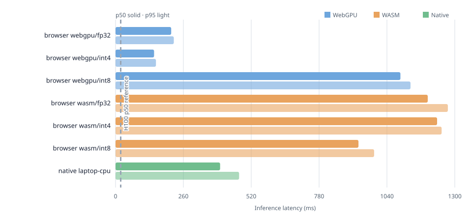
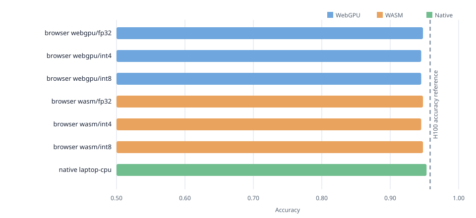
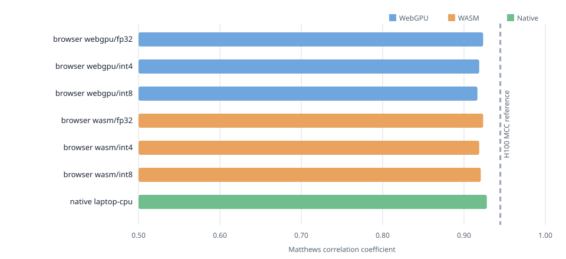
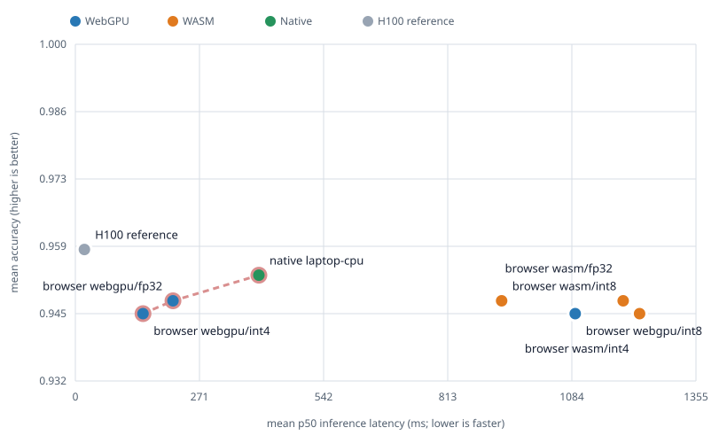

# WebTabPFN

TabPFN v2 classification in the browser from one classic script. WebTabPFN downloads a ready
FP32, INT4, or INT8 model, caches it across pages with Cache Storage, uses WebGPU when available,
and falls back to WASM. End users need no Python, package manager, build step, or quantization.

> **Built with PriorLabs-TabPFN.** WebTabPFN is an independent, unofficial browser port and is
> not affiliated with or endorsed by Prior Labs.

## Use

Use an exact npm version through jsDelivr for a zero-install deployment. Loading the script does
**not** download a model. The selected weights are fetched lazily when `load()` is called:

```html
<script src="https://cdn.jsdelivr.net/npm/webtabpfn@0.1.0/src/webtabpfn.js"></script>
<script>
  const classifier = await WebTabPFN.load();

  classifier.fit(
    [[0.1, 1.2], [0.2, 0.8], [1.1, 0.1], [0.9, 0.2]],
    [0, 0, 1, 1],
  );

  const predictions = await classifier.predict([[0.8, 0.3]]);
  const probabilities = await classifier.predictProba([[0.8, 0.3]]);
  console.log(predictions, probabilities, classifier.info);
</script>
```

Pin an exact version in production; do not use an unversioned or `@latest` URL. To self-host,
serve the contents of `src/` together and use `/path/to/src/webtabpfn.js` instead. Models and the
ONNX Runtime assets resolve relative to the script URL unless their base URLs are overridden.

Training labels must be dense integers starting at zero (`0..C-1`). Every row must contain the
same number of numeric features. `fit()` stores the training context locally; inference happens
when `predict()`, `predictProba()`, or `infer()` is awaited.

### Model selection

`load()` accepts the following options:

| Option | Values | Default |
|---|---|---|
| `backend` | `"auto"`, `"webgpu"`, `"wasm"` | `"auto"` |
| `precision` | `"fp32"`, `"int4"`, `"int8"` | INT4 on WebGPU, INT8 on WASM |
| `baseUrl` | Base directory for model assets | Directory containing `webtabpfn.js` |
| `runtimeBaseUrl` | Base directory for ONNX Runtime assets | `baseUrl` |
| `cache` | `true`, `false` | `true` |

```javascript
// Smallest download and the default WebGPU model.
const compact = await WebTabPFN.load({ backend: "webgpu", precision: "int4" });

// Default CPU/WASM choice: larger than INT4, but faster in the current benchmarks.
const cpu = await WebTabPFN.load({ backend: "wasm", precision: "int8" });

// Unquantized reference model.
const reference = await WebTabPFN.load({ precision: "fp32" });
```

With `backend: "auto"`, WebTabPFN first uses WebGPU/INT4 when WebGPU is exposed by the browser.
If WebGPU session creation fails, it retries with WASM/INT8. That fallback can download both
models. Supplying an explicit `precision` keeps the same model precision during fallback.

### Preloading and browser caching

Preloading is optional. It downloads, verifies, and persistently caches weights but does not
create an inference session. Normal `load()` remains lazy by default.

```javascript
// For example, call this during an idle period or before opening a prediction view.
await WebTabPFN.preload();

// Uses the cached automatic default when the same model is selected.
const classifier = await WebTabPFN.load();
```

To prepare both automatic paths in advance:

```javascript
await Promise.all([
  WebTabPFN.preload({ backend: "webgpu", precision: "int4" }),
  WebTabPFN.preload({ backend: "wasm", precision: "int8" }),
]);
```

Cache management is explicit:

```javascript
const int4Ready = await WebTabPFN.isCached("int4");
const int8Ready = await WebTabPFN.isCached("int8");

// Download for this call without writing to Cache Storage.
const temporary = await WebTabPFN.load({ precision: "int4", cache: false });

// Remove every WebTabPFN model stored by this origin.
await WebTabPFN.clearCache();
```

Cache Storage is shared by pages on the same origin, so a model downloaded on one page can be
reused on another. It is not shared across unrelated websites, and browsers may evict stored data
under storage pressure. Model filenames are content-hashed; new downloads are checked against
their byte length and SHA-256 digest, and cached responses are length-checked before use.

### Custom asset location

Normally models and ONNX Runtime are resolved relative to `webtabpfn.js`. Override the locations
when serving them from a separate static directory or CDN:

```javascript
const classifier = await WebTabPFN.load({
  baseUrl: "https://cdn.example.org/webtabpfn/0.1.0/",
  runtimeBaseUrl: "https://cdn.example.org/webtabpfn/0.1.0/",
});
```

Cross-origin asset servers must permit browser CORS requests.

The global API also exposes `models` for model metadata and `hasWebGpu()` for feature detection.
`src/` is the directly deployable package: the library, ONNX Runtime assets, model license, and
the three ready weights under `src/models/`.

## Layout

```text
src/        browser library, runtime, license, and models/
benchmark/  benchmark page, reference data, consolidated results, and plots/
tests/      unit and browser tests plus Playwright configuration
scripts/    build, export, quantization, benchmark, merge, and plotting tools
```

## Build and test

Node.js and pnpm are required only for development:

```powershell
pnpm install
pnpm build
pnpm test
pnpm test:browser
python -m http.server 8000
```

The benchmark runner is available at <http://localhost:8000/benchmark/>.

## Model preparation

Model export and quantization are maintainer-only operations. Python 3.11 is required:

```powershell
py -3.11 -m venv .venv
.venv\Scripts\pip install -r scripts\requirements.txt
.venv\Scripts\python scripts\prepare-models.py
pnpm build
```

The script downloads the official TabPFN v2 classifier, validates its FP32 export, creates
optimized INT4 and INT8 ONNX files, checks native parity, and publishes hashed weights to
`src/models/`. Temporary checkpoints and intermediate models stay in the ignored `.build/`
directory.

## Benchmarks

- `scripts/benchmark-native.py` runs regular Python TabPFN on CPU or CUDA and writes the shared
  cases and reference.
- `scripts/benchmark-browser.js` measures all FP32, INT4, and INT8 combinations through the
  public `WebTabPFN` API on WebGPU and WASM.
- `scripts/merge-benchmarks.py` combines labeled JSON runs.
- `scripts/plot-benchmarks.py` writes latency, accuracy, MCC, and speed-versus-accuracy SVGs.

Generate a fresh native reference, serve the repository, and open the benchmark page:

```powershell
.venv\Scripts\python scripts\benchmark-native.py --device cpu
python -m http.server 8000
```

Every timing result includes raw runs, count, minimum, mean, standard deviation, p50, p75, p90,
p95, p99, and maximum. Accuracy, MCC, prediction agreement, and probability drift are also saved.
The reference contains eight deterministic cases: Breast Cancer, Wine, synthetic four-class,
Iris, Digits, noisy Moons, noisy Circles, and an imbalanced synthetic three-class problem.
The consolidated result is `benchmark/results.json`. Regenerate its plots with:

```powershell
python scripts\plot-benchmarks.py
```

SVG output is written to `benchmark/plots/`.

### Experimental floating-point formats

FP16, weight-only FP8 E4M3FN, and blockwise FP4 were tested with ONNX Runtime Web 1.27 on the
Intel Xe-LPG laptop WebGPU adapter. They are not shipped because none improves the deployable
trade-off:

| Format | Model bytes | Result |
|---|---:|---|
| FP16 | 14,745,318 | Session runs, but produces non-finite logits |
| FP8 | 7,623,461 | WebGPU session creation fails |
| FP4 | 4,902,696 | Runs, but averages 1,517 ms p50, 0.932 accuracy, and 0.903 MCC |
| INT4 | 5,126,894 | Averages 148 ms p50, 0.945 accuracy, and 0.919 MCC |

The recorded runs are in `benchmark/fp16-fp8-webgpu.json` and `benchmark/fp4-webgpu.json`.

### Current benchmark plots









## License

WebTabPFN's original source code is licensed under Apache-2.0; see `LICENSE`.

The TabPFN weights under `src/models/` use the Prior Labs License v1.2 in
`src/TABPFN_MODEL_LICENSE.txt`. Any website, interface, blog post, about page, product
documentation, or other distribution using the weights must include that license and prominently
display the exact attribution **Built with PriorLabs-TabPFN**.

The bundled ONNX Runtime Web 1.27.0 runtime is licensed by Microsoft under the MIT License. Its
license and bundled-component notices are included in `src/ONNXRUNTIME_LICENSE.txt` and
`src/ONNXRUNTIME_THIRD_PARTY_NOTICES.txt`.
